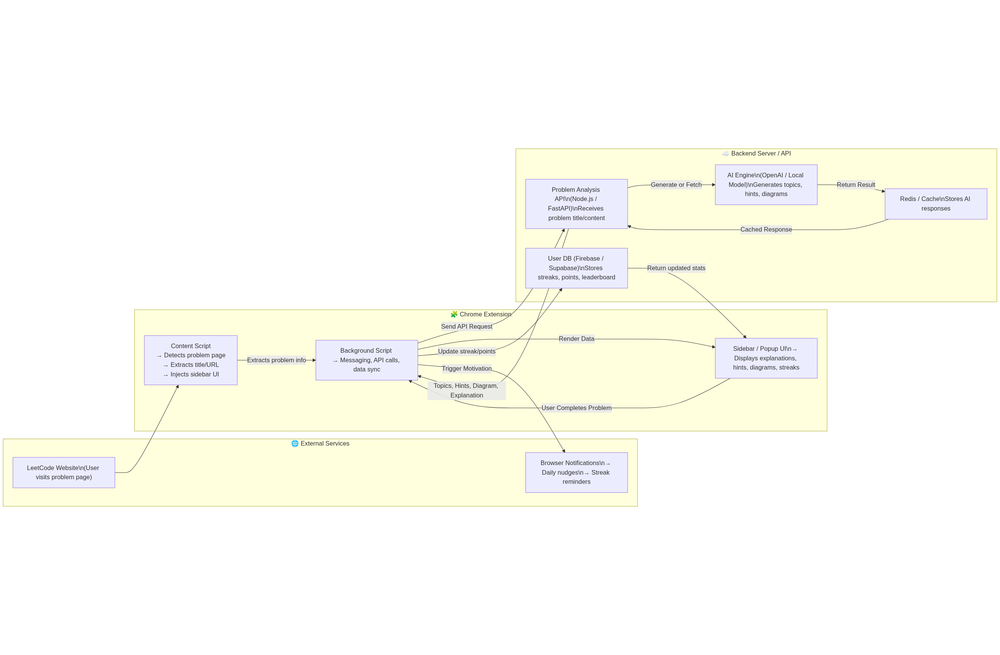

A leetcode companion as one would like, eliminate your doubts and dsa skills by using an ai assistant while doing DSA.

Currently work in progres..



---

### 🧠 Simplified System Design: “AI-Enhanced LeetCode Assistant”

---

#### **1. Client Layer (Chrome Extension)**

**Components:**

* **Content Script**

  * Detects when the user opens a LeetCode problem.
  * Extracts metadata (title, URL, description).
  * Injects the sidebar UI into the page.
* **Background Script**

  * Handles messaging, API calls, and data synchronization.
  * Sends extracted problem info to the backend.
  * Updates and retrieves user streaks and motivation data.
* **Sidebar / Popup UI**

  * Displays AI-generated hints, diagrams, and user streak progress.
* **Browser Notifications**

  * Sends daily streak reminders and motivational nudges.

---

#### **2. Backend Layer (API + AI Engine)**

**Components:**

* **API Gateway (Node.js / FastAPI)**

  * Receives requests from the Chrome extension.
  * Manages routing and authentication.
* **AI Engine (OpenAI / Local Model)**

  * Generates hints, explanations, and topic diagrams based on problem content.
* **Cache Layer (Redis)**

  * Stores AI responses for faster repeated queries.
* **User Database (Firebase / Supabase)**

  * Tracks user streaks, points, and leaderboard data.
  * Syncs with the Chrome extension for real-time updates.

---

#### **3. Data Flow Overview**

1. User opens a **LeetCode problem** → Extension detects it.
2. **Content Script** extracts problem info → sends to **Background Script**.
3. **Background Script** sends API request to backend.
4. **Backend API** checks cache → fetches or generates hints using **AI Engine**.
5. **AI Result** stored in Redis + sent to extension.
6. **User DB** updates streaks and points.
7. **Extension UI** displays explanations and stats.
8. **Notifications** remind users to maintain streaks.

---

### 🧩 Simplified Diagram (Text Form)

```
[User (LeetCode Page)]
       │
       ▼
[Chrome Extension]
 ├── Content Script ──► Background Script ──► Backend API
 │        │                       │
 │        ▼                       ▼
 │   Sidebar UI  ◄──────────────  User DB
 │                              (Streaks, Points)
 │
 └── Notifications ◄──────────────┘
[Backend]
 ├── API Gateway (FastAPI/Node.js)
 ├── AI Engine (OpenAI / Local)
 ├── Cache (Redis)
 └── Database (Firebase / Supabase)
```

---

